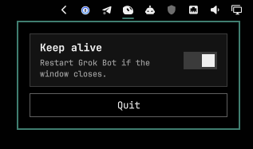

# omarchy-grok-bot

Omarchy bar plugin for [Grok Bot](https://x.ai/bot). Keeps the local-exec process running and puts the blob on the bar so you can show or hide the window.

Plugin id: `limehawk.grok-bot`

Requires Omarchy (Quattro / `omarchy-shell`) and `/usr/bin/grok-bot`.

> [!WARNING]
> Plugins run unsandboxed inside `omarchy-shell`. Only add this from a repo you trust.

## Install

```bash
omarchy plugin add https://github.com/limehawk/omarchy-grok-bot.git
omarchy plugin enable limehawk.grok-bot
```

`omarchy plugin add` clones into `~/.config/omarchy/plugins/limehawk.grok-bot/` and leaves the plugin disabled until you enable it.

New Grok Bot windows need a Hyprland rule so they open parked instead of stealing the current workspace. In `~/.config/hypr/hyprland.lua`:

```lua
o.window("^grok-bot$", {
  workspace = "special:grokbot silent",
  no_initial_focus = true,
})
```

That is a named special workspace (`special:grokbot`), not the Super+S scratchpad. Hyprland reloads the file on save; if it doesn’t, `hyprctl reload`.

## Use



| Input | Action |
| --- | --- |
| Left-click | Show or hide the window |
| Right-click | Keep alive, Relaunch, and Quit |

Keep alive on (default): start at login, restart if you close the window. Off: dead stays dead. Relaunch kills the process and starts it again without changing keep alive. Quit turns keep alive off and kills the process.

The blob is dim when Grok Bot is not running.

Pushes to `main` tag a new patch release (`v0.1.0`, `v0.1.1`, …) on Forgejo and GitHub. `omarchy plugin add` still tracks `main`; pin a tag if you want a frozen checkout.
